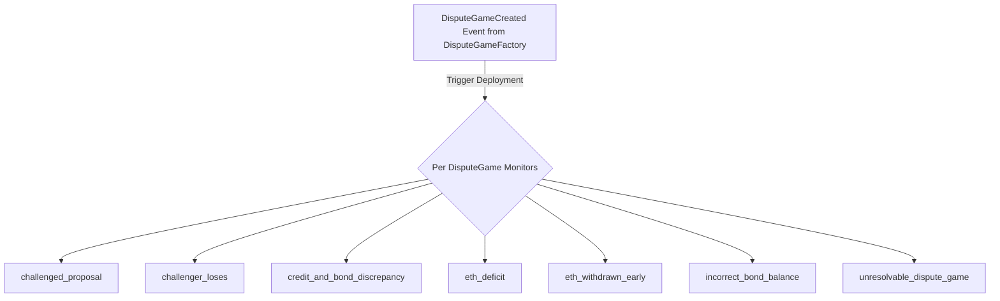
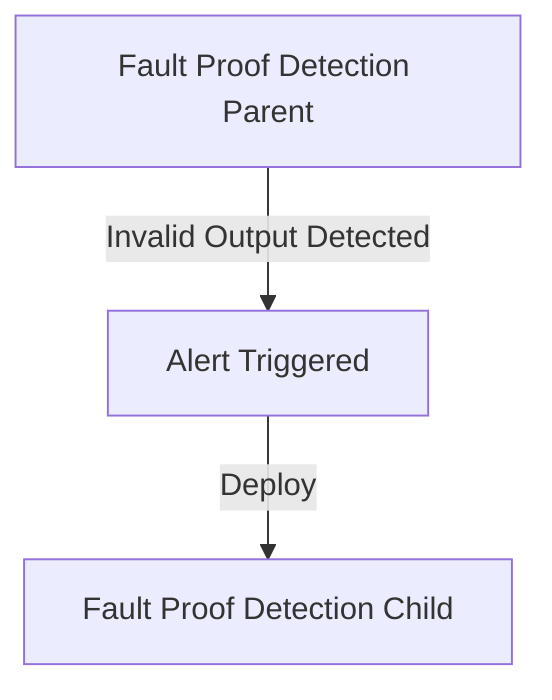

# Fault Proof Monitors

Fault proofs are a crucial component in ensuring the security and decentralization of L2 rollups. They enable a permissionless and decentralized approach to proposing and validating the state of the chain, allowing anyone to participate in securing the network. With fault proofs now live on Base Mainnet, monitoring these systems is essential to maintain the integrity and trustlessness of the network.

This repository contains a collection of monitors written in **gate**, a descriptive language developed by Hexagate for defining invariants for real-time monitoring of every block. These monitors are designed to observe and detect anomalies within the fault proof system on any OP Stack chain, ensuring that any potential issues are identified and addressed promptly.

## Monitors

Each monitor in this repository targets specific aspects of the fault proof system to detect potential safety and liveness issues. Detailed explanations, including the purpose, technical overview, and importance of each monitor, are provided in the `docs` folder.

### Table of Monitors

| Monitor | Tests | Docs | Deployment |
| ------- | ----- | ---- | ---- |
| [challenged_proposal.gate](./monitors/challenged_proposal.gate) | [challenged_proposal_test.go](./tests/challenged_proposal_test.go) | [challenged_proposal.md](./docs/challenged_proposal.md) | Per DisputeGame |
| [challenger_loses.gate](./monitors/challenger_loses.gate) | [challenger_loses_test.go](./tests/challenger_loses_test.go) | [challenger_loses.md](./docs/challenger_loses.md) | Per DisputeGame |
| [credit_and_bond_discrepancy.gate](./monitors/credit_and_bond_discrepancy.gate) | [credit_and_bond_discrepancy_test.go](./tests/credit_and_bond_discrepancy_test.go) | [credit_and_bond_discrepancy.md](./docs/credit_and_bond_discrepancy.md) | Per DisputeGame |
| [duplicate_dispute_game.gate](./monitors/duplicate_dispute_game.gate) | [duplicate_dispute_game_test.go](./tests/duplicate_dispute_game_test.go) | [duplicate_dispute_game.md](./docs/duplicate_dispute_game.md) | Single Instance |
| [eth_deficit.gate](./monitors/eth_deficit.gate) | [eth_deficit_test.go](./tests/eth_deficit_test.go) | [eth_deficit.md](./docs/eth_deficit.md) | Per DisputeGame |
| [eth_withdrawn_early.gate](./monitors/eth_withdrawn_early.gate) | [eth_withdrawn_early_test.go](./tests/eth_withdrawn_early_test.go) | [eth_withdrawn_early.md](./docs/eth_withdrawn_early.md) | Per DisputeGame |
| [fault_proof_detection_parent.gate](./monitors/fault_proof_detection_parent.gate) | N/A | [fault_proof_detection_parent_and_child.md](./docs/fault_proof_detection_parent_and_child.md#fault-proof-detection-parent) | Single Instance |
| [fault_proof_detection_child.gate](./monitors/fault_proof_detection_child.gate) | N/A | [fault_proof_detection_parent_and_child.md](./docs/fault_proof_detection_parent_and_child.md#fault-proof-detection-child) | Specific DisputeGame |
| [incorrect_bond_balance.gate](./monitors/incorrect_bond_balance.gate) | [incorrect_bond_balance_test.go](./tests/incorrect_bond_balance_test.go) | [incorrect_bond_balance.md](./docs/incorrect_bond_balance.md) | Per DisputeGame |
| [unresolvable_dispute_game.gate](./monitors/unresolvable_dispute_game.gate) | [unresolvable_dispute_game_test.go](./tests/unresolvable_dispute_game_test.go) | [unresolvable_dispute_game.md](./docs/unresolvable_dispute_game.md) | Per DisputeGame |

### Testing

Several of the Fault Proof monitors have unit tests that can be run to ensure the monitor is working correctly. Hexagate's API provides an endpoint for mocking and testing gate monitors, but in order to use the endpoint you must have an API key. Once you have a Hexagate API key, configure the `.env` with the key:

```sh
cp .env.example .env
```

Then paste the key into the `.env` file. Once your `.env` is setup, run the following to test the monitors:

```sh
go test -v ./tests # run all tests
go test -v ./tests/hexagate_api.go ./tests/<test_file> # run specific monitor test suite
```

## Deployment Workflows

There are three unique deployment workflows for the above monitors:
- **Single Instance**: Deployed once as a single invariant monitor.
- **Per DisputeGame**: Deployed to every dispute game created following DisputeGameCreated event.
- **Specific DisputeGame**: Deployed to specific dispute games following an alert from a parent monitor (ex. fault_proof_detection_parent).

Per DisputeGame and Specific DisputeGame monitors require additional workflow automation to trigger monitor deployment. Refer to the following sections for more details.

### Per DisputeGame 

To deploy monitors to each dispute game created:

1. Create a `Contract Event` monitor to listen for `DisputeGameCreated` events from the `DisputeGameFactory` contract.
2. Set the notification channel to a webhook URL that will trigger the deployment workflow.
3. Upon receipt of alert, extract the `disputeGameAddress` and update dispute game monitor parameters to prepare for deployment.
4. Deploy monitors using the [Create User Monitor](https://hexagate.gitbook.io/api-documentation/reference/api-reference/monitoring-management/v1-monitor-with-a-single-condition#creating-a-new-monitor) endpoint. 

Refer below for a high level deployment workflow for per dispute game monitors.



#### Specific DisputeGame

To deploy monitors to a specific dispute game:

1. Create `parent` monitor that will trigger `child` monitor deployment flow.
2. Set notification channel to webhook URL that will trigger deployment workflow.
3. Upon receipt of `parent` monitor alert, extract details and update `child` monitor parameters to prepare for deployment.
4. Deploy monitors using the [Create User Monitor](https://hexagate.gitbook.io/api-documentation/reference/api-reference/monitoring-management/v1-monitor-with-a-single-condition#creating-a-new-monitor) endpoint. 

Refer below for a high level deployment workflow for `FaultProofDetection` monitors (parent and child):

